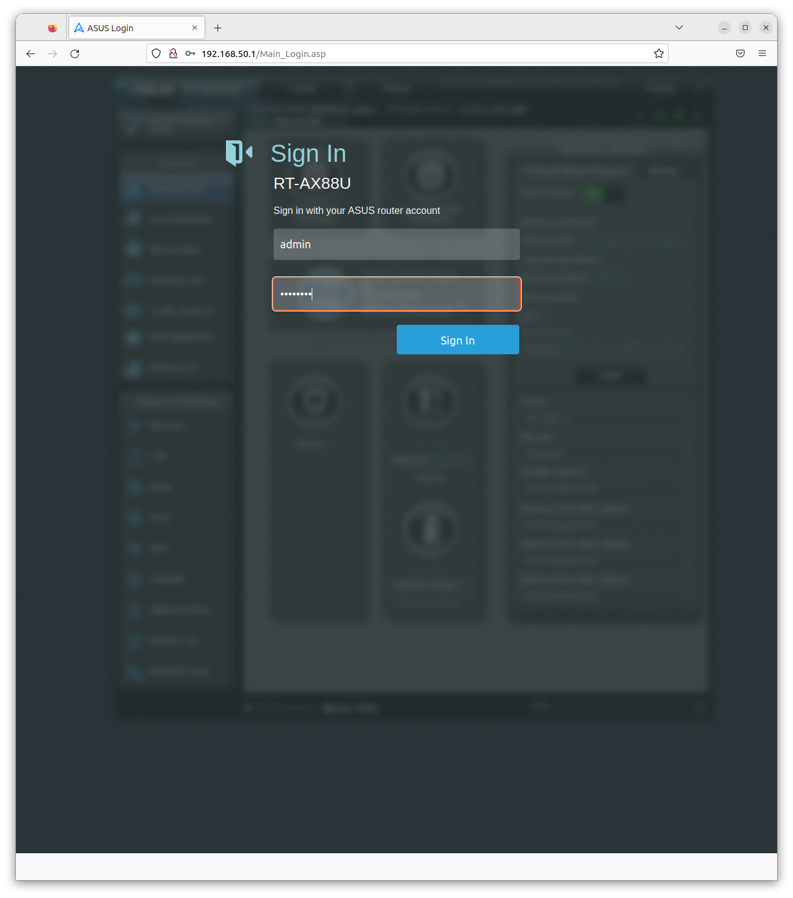
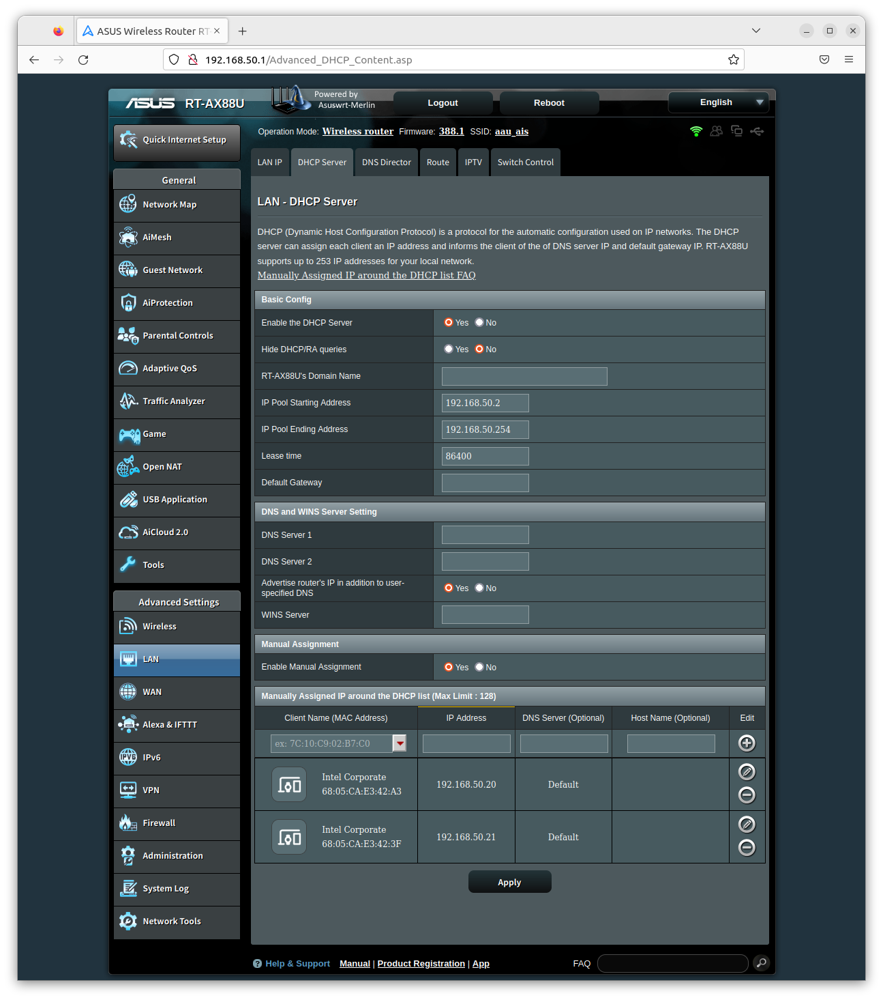
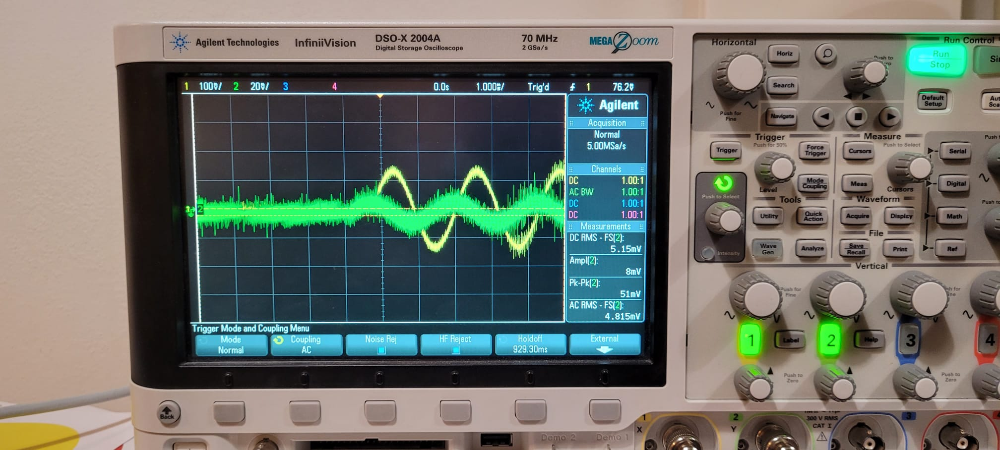
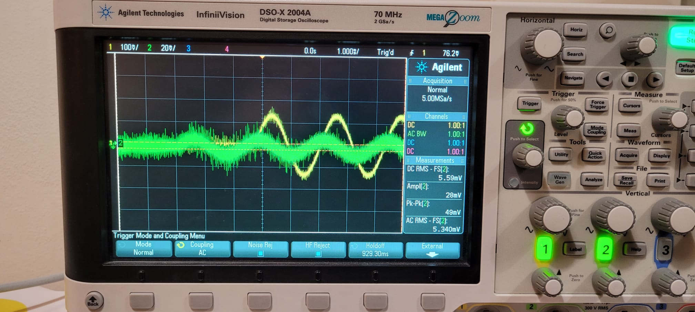
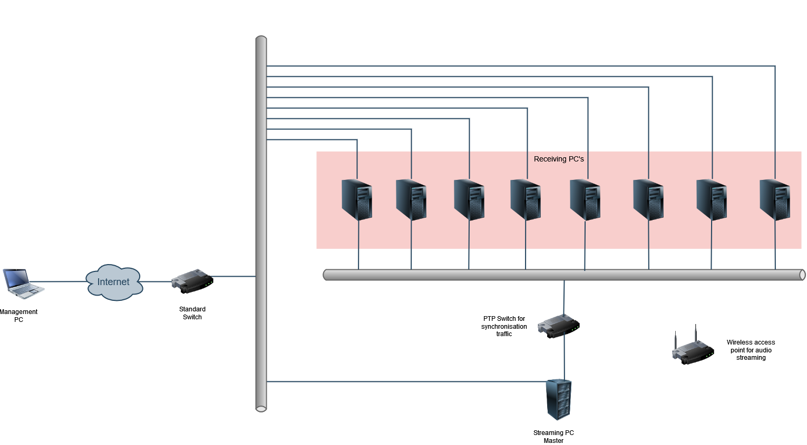

# AAU_Audio_Sync

# Prerequisites
This repository assumes that you are using ubuntu 22


# Repository Structure
```bash
.
└── src #Source code for all files
    ├── interface.cfg #Stores the interface variable
    ├── config_scripts #Scripts to configure the device
    │   └── interface_config.sh #binds an interface to an ip address
    ├── gstreamer #Sample scripts to create a synchronized media stream
    │   ├── gstreamer_master.sh #configures the master device stream
    │   ├── greamer_slave_1.sh #configures the local device as slave
    │   └── greamer_slave_2.sh #configures a remote device as a slave 
    ├── install_scripts #Scripts to install the appropriate software 
    │   ├── asound.conf #configuration file for audio config
    │   ├── gstreamer_install.sh #install the latest version of gstreamer
    │   └── linuxptp_install.sh #installs the lates version of linuxptp
    └── ptp #scripts to configure synchronisation
        ├── config_files #Directory containing the options for ptp
        │   ├── phc2sys.cfg
        │   ├── ptp4l_master.cfg
        │   └── ptp4l_slave.cfg
        ├── phc2sys_launch.sh #Synchronizes the sys clock to the ptp clock
        ├── ptp4l_master_launch.sh #Starts ptp as a master
        └── ptp4l_slave_launch.sh #Starts ptp as a slave

```


## Installation
To install linuxptp execute:
```
sudo ./src/install_scripts/linux_ptp.sh
```

similarly, for gstreamer run:
```
sudo ./src/install_scripts/gstreamer_install.sh
```
If there are issues with audio streaming, it may be necessary to copy the configuration found in:
```
/src/install_scripts/asound.conf
```
to
```
/etc/asound.conf 
```

## Configuration
Following installation of the required software packages, ip addresses and interfaces must be configured.

### Interface config
The PTP scripts need to know which networking interface to target. This is configured by setting the interface variable in:
```
/src/interface.cfg
```

The list of interfaces can be found using:
```
ifconfig
```

### IP Config
I recommend that you configure a static ip address for the PTP ethernet interfaces in your routers DHCP configuration. To do this in your RT-AX88U router you must first login. By the time of writing, the default gateway is 192.168.50.1 and the credentials are:
```
username: admin
password: Pass1234
```

To set static ip's for the connected devices navigate to LAN->DHCP Server->Manually assign IP


In case you do not wish to use router defined static ip's you can directly alter the interface ip address using the script:
```
/src/config_scripts/interface_config.sh
```
Before executing it, remember to modify the file's desired ip address 

## PTP Setup
To run PTP first launch the master device using:

### Master
```
sudo ./ptp4l_master_launch.sh
```
and synchronize the system clock of the master device to the ptp clock:
```
sudo ./phc2sys_launch.sh
```

### Slave
To start the slave device, first make sure the `UDPv4` ip address set in `/src/ptp/config_files/ptp4l_slave.cfg` matches the ip of the master device.

Next start the slave device using:
```
sudo ./ptp4l_slave_launch.sh
```

and synchronize the system clock of the slave device to the ptp clock:
```
sudo ./phc2sys_launch.sh
```

## Gstreamer Setup
Streaming using gstreamer should only be started after ptp synchronization is complete.

First, start the gstreamer slave devices. The slave located on the same physical system as the master device is started with:
```
sudo ./gstreamer_slave_1.sh
```
To start another slave on a remote device run the second script:
```
sudo ./gstreamer_slave_2.sh
```

After both slaves have been started you can start the master script:

```
sudo ./gstreamer_master.sh
```

In case of issues, check to make sure that the ip addresses in `gstreamer_slave_2.sh` and `gstreamer_master.sh` match the network configuration of the actual devices.

## Results
Using the method descripted above to synchronize two PC's using I210 NIC connected through an AX88U router, time synchronisation in the order of 10s of nanoseconds was achieved.

To compare the delay between two gstreamer audio streams the audio output of the devices can be connected to an oscilloscope and compared. Initially when gstreamer is first started on the devices, we see synchronisation in the order of 100's of us:


however over the next couple of minutes the time shift between the two streams increase to a couple of milliseconds:


The reason for this desynchronisation is not known to me, though I suspect it has something to do with the gstreamer configuration.

# Future network setup
For your final setup I recommend that you split your traffic into three types across three distinct hardware interfaces:

1. Ethernet connection to AAU networking. To allow the devices the abillity to receive updates from the internet and for the remote management.
2. Ethernet based PTP synchronisation. To provide optimal results, this may require a specialised switch with build in support for PTP. However, initially I suggests you start by trying to use a cheap normal switch.
3. WIFI for audio streaming.

The proposed setup is shown below:


To allow for a more flexible setup, I recommend that the 8 receiving PC's have atleast one build in ethernet port (for the management network) and space for at least three PCIe expansion cards:

- I210 NIC for the PTP network
- A WIFI card for the audio streaming network
- A soundcard (I assume you don't wanna use the crappy output from the build in sound card?) 
